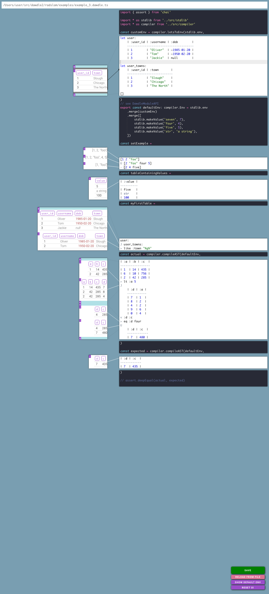

# Dawdle

Dawdle is a relational DSL that I played around making in 2018, the aim was to explore some stuff surrounding relational theory and building an interpereter - _hence a lot of the code is questionable quality_. Hopefully, you can get things running with:

```bash
cd radslam
npm run bundle -- --mode development  # --watch
npm run ts -- src/server.ts
google-chrome http://localhost:3000/?path=examples/example_3.dawdle.ts
```

## A screenshot from the editor 

(what self-respecting DSL project _doesn't_ come with an IDE...)



## Syntax

- `relation`s are in the form `some_relation:`
- `header`s are in the form `:some_header`
- plain ol' sets are in the form `["a-str" 5 :some_header]`
- the literal types supported are the JSON types, plus:
  - datetimes in the form `~some-ISO-8601`
  - decimals in the form `$1.05`
  - templates in backticks with `{{}}` interpolation
- the columns themselves are not typed, it is up to the host language
  to enforce.

Now some relational operations, we have:
- `>` filter
- `v` select
- `^` extend
- `X` cross
- `U` union
- `-` difference
- `J` join
- `G` group

`> v ^` are pictographic, `X U -` also operate on sets

Also, notice the indented relation literal after the joins. Indented sections
are appended to the args of the operation above them.

## Design choices:

- Each line of dawdle should map deterministically both ways to the JSON AST
- Given an environment, it should always be possible to determine the schema (ie. the headers) at any line
- Operation lines are ordered, but don't *have* to be executed in a ordered way, it's up to the host language (which could for example compile the query to SQL)
- Given test values, it should always be possible to determine the value at any line of a top level let or section
- Composite operators can only be composed of the base operators and other composite operators
- Sets are splatted in place when called with relation operators

## Basic query snippet

```
jira_ticket:
> like :ticket "INTEG%"
> equals :issuetype "Task"
> ilike :summary `%{{oem}}%{{release}}%tracking ticket%`
^ :rank order :created
```

## Defining composite operators

```
def Rename relation: old new
    let final_headers
        relation:*
        - old
        U new

    relation:
    ^ new identity old
    v final_headers


def Namespace relation: namespace ignore
    let to_rename
        relation:*
        - ignore

    relation:
    (map to_rename) `Rename {{_}} {{namespace}}.{{_}}`
```

## Example snippet with a group by

```
let counts_seen:
    run:
    v :run_id groups
    > in :run_id
        reverse_indexed_in_groups:
        > lte :n max_n_runs
        v :run_id
    J
        result:
        v :run_id :result_id :duration
    G :run_id
        :number_of_results count :result_id
        :total_duration sum :duration
 ```

## An example with definitions used

_Not sure this outer join definitition is even correct looking at it now.._

```
def Outer relation: right:
    let joined:
        relation:
        J right:

    let just_right_headers
        right:*
        - relation:*

    relation:
    -
        joined:
        v relation:*
    X
        right:
        > first
        v just_right_headers
        (map just_right_headers) `^ {{_}} make_null`
    U joined:

let not_foo
    [:left_id]
    U [:l]

let left:
    | :left_id | :l | :nah |
    ------------------------
    | 1        | 10 | 9    |
    | 2        | 20 | 9    |
    | 3        | 30 | 9    |
    ^ :foo value 8

left:
v :left_id :l :foo
v not_foo
Outer
    | :right_id | :left_id | :r |
    -----------------------------
    | 1         | 1        | 11 |
    | 2         | 1        | 12 |
    | 3         | 2        | 23 |
^ :new_header value 9
```

should give:

```
| :left_id | :l | :right_id | :r   | :new_header |
--------------------------------------------------
| 1        | 10 | 1         | 11   | 9           |
| 1        | 10 | 2         | 12   | 9           |
| 2        | 20 | 3         | 23   | 9           |
| 3        | 30 | null      | null | 9           |
```

## multi-relation syntax

I had _some_ thoughts about how one might return nested relationship-y results:

```

relation:
-[]-
    -[basket basket_discount:
        ]-join basket__discount:
            -[discount discount:
        -[purchase purchase:
            -[product product:
```

_I can't fully remember what this was meant to do, but `-[` and `]-` represent one-to-many and many-to-one._
