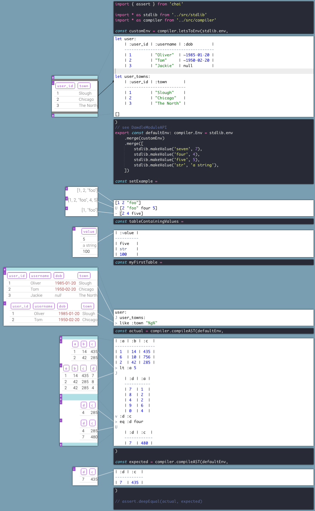

# Dawdle

Dawdle is a relational DSL that I played around making in 2018, the aim was to explore some stuff surrounding relational theory and building an interpereter - _hence a lot of the code is questionable quality_. Hopefully, you can get things running with:

```bash
cd radslam
npm run bundle -- --mode development  # --watch
npm run ts -- src/server.ts
google-chrome http://localhost:3000/?path=examples/example_3.dawdle.ts
```

A screenshot from the editor:



Some random notes copy-pasta-ed from the code:

# Syntax

- `header`s are in the form `:some_header`
- the types supported are the JSON types, plus:
  - datetime in the form `~some-ISO-8601`
  - decimals in the form `$1.05`
- the columns themselves are not typed, it is up to the host language
  to enforce.

Now some relational operations, we have:
`>` filter
`v` select
`^` extend
`X` cross
`U` union
`-` difference
`J` join
`G` group

`> v ^` are pictographic

Also, notice the indented relation literal after the joins. Indented sections
are appended to the args of the operation above them.

# An example with definitions and things

```
def Outer relation: right:
    let joined:
        relation:
        J right:

    let just_right_headers
        right:*
        - relation:*

    relation:
    -
        joined:
        v relation:*
    X
        right:
        > first
        v just_right_headers
        (map just_right_headers) \`^ {{_}} make_null\`
    U joined:

let not_foo
    [:left_id]
    U [:l]

let left:
    | :left_id | :l | :nah |
    ------------------------
    | 1        | 10 | 9    |
    | 2        | 20 | 9    |
    | 3        | 30 | 9    |
    ^ :foo value 8

left:
v :left_id :l :foo
v not_foo
Outer
    | :right_id | :left_id | :r |
    -----------------------------
    | 1         | 1        | 11 |
    | 2         | 1        | 12 |
    | 3         | 2        | 23 |
^ :new_header value 9
```

should give:

```
| :left_id | :l | :right_id | :r   | :new_header |
--------------------------------------------------
| 1        | 10 | 1         | 11   | 9           |
| 1        | 10 | 2         | 12   | 9           |
| 2        | 20 | 3         | 23   | 9           |
| 3        | 30 | null      | null | 9           |
```
